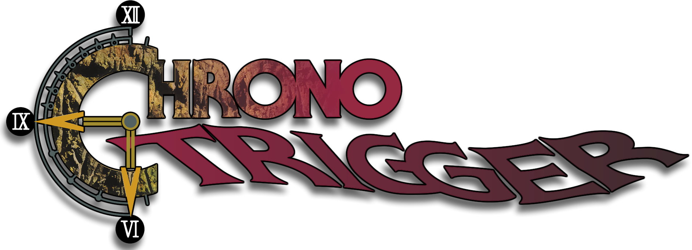

<div align=center>



</div>
<h1 align=center>Chrono Trigger — PortMaster (aarch64 Linux) port</h1>

A loader/port of the Android version of *Chrono Trigger*
(`com.square_enix.android_googleplay.chrono`, v2.1.5) for **PortMaster** handhelds
(aarch64 Linux). It maps the original
Android `arm64-v8a` `.so` files, shims their imports to native libraries, and runs the
game in a minimal emulated-Android environment via **SDL2 + GLES2**.

This is a sibling of [`ct_nx`](https://github.com/NaGaa95/ct_nx) (the Nintendo Switch
port). The codebase is **dual-target**: the OS layer is behind `#ifdef __SWITCH__`, so the
same `source/` builds for both Switch (libnx) and Linux (SDL2/POSIX, in `portmaster/`).

> Status: **playable** — boots, renders on the GPU, plays and saves. Verified on a
> **TrimUI Smart Pro** (Allwinner A133 / PowerVR GE8300), **Anbernic RG40XX-V** and
> **RG35XX-SP** (Allwinner H700 / Mali-G31). **All testing to date has been on Knulli**;
> other PortMaster CFWs (muOS, ArkOS, ROCKNIX, AmberELEC) are expected to work but are
> untested. See `portmaster/NOTES.md`.

## Install

1. Download `ct.zip` from [Releases](https://github.com/springah/ct_pm/releases). It
   contains the port only — no game data.
2. Extract it into your device's ports folder, so you end up with
   `.../ports/Chrono Trigger.sh` and `.../ports/ct/`. (PortMaster's own
   *Install from zip* option does the same thing.)
3. Add the game files from your own APK — see below. Without them the port shows a
   message telling you what is missing and exits.
4. Launch **Chrono Trigger** from the Ports menu.

## Controls

| | |
| --- | --- |
| D-pad / left stick | Move (right stick also works) |
| A | Confirm · B | Cancel / dash |
| X / Y | Menu shortcuts |
| L / R | Page / cycle |
| **Start + Select** | **Quit the game** |

**There is no in-game exit** — use **Start + Select** (the hardware **MENU** button plus
Start also works). Powering the device off mid-game instead risks losing your save.

## You supply the game

No game assets or original code are included. An APK is just a ZIP — rename it to `.zip`
and open it. From your own legally-owned APK (v2.1.5) you need:
* `lib/arm64-v8a/libchrono.so` — the engine
* `lib/arm64-v8a/libc++_shared.so` — its C++ runtime
* the entire `assets/` folder (`resources.bin`, `001.dat`…`008.dat`, `007-en.dat`,
  `Shaders/`, `build_date.txt`)

Place them in the port's game directory (`.../ports/ct/`) alongside the `ct` binary.
`portmaster/multiverse/ct.md` has the step-by-step extraction walkthrough.

## Build (PortMaster / aarch64 Linux)

Built in the PortMaster aarch64 builder image (glibc 2.31 for broad device compatibility).
First build the bundled decode-only FFmpeg once, then the game:

```sh
IMG=ghcr.io/monkeyx-net/portmaster-build-templates/portmaster-builder:aarch64-latest

# 1) minimal FFmpeg 7.1 (mov + h264/hevc/aac decode + swscale/swresample) -> $FF/{include,lib}
#    see portmaster/ffmpeg-build.sh (LGPL; ~3.8 MB of .so, sonames .61/.59/.8/.5)

# 2) the game, with the FMV player linked
docker run --rm --platform=linux/arm64 \
  -v "$PWD":/workspace -v "$FF":/ff -w /workspace "$IMG" bash portmaster/build.sh
```

`portmaster/build.sh` compiles `source/movie_player.c` (the real FMV player) and links the
bundled FFmpeg; the 5 `.so.*` are copied into `portmaster/pkg/ct/libs.aarch64/` and found at runtime
via the launcher's `LD_LIBRARY_PATH`. For a quick boot-to-title build without ffmpeg, swap
in `portmaster/movie_stub.c`. See `portmaster/NOTES.md` for the full architecture, the FMV
section, milestone history, and the `os_*` abstraction map.

## Displays: what to expect

The engine picks a design resolution per aspect ratio and scales it to whatever panel
it is told. Stock, the 16:9 entry is **568×320**, so no common panel is an exact integer
multiple of it — 720p works out to ~2.25×. The framing cluster (see Configuration:
`ui_scale_fix` / `field_zoom_fix` / `font_snap`, on by default) replaces that with an
exact whole-number scale per panel:

* **16:9 panels are its home turf, and 720p looks best in practice** — the canvas becomes
  640×360 at exactly 2×, the field is drawn at 4×4 panel px per art px (320×180 art px
  visible, the ct_nx Switch framing), and text lands on the pixel font's own grid.
* **4:3 and other aspects work.** Stock, the engine draws the field at a fractional
  zoom there (~2.5×2.2 panel px per art px at 640×480) and its pixel font off the
  pixel grid, so everything looks slightly uneven; the framing cluster below
  (`ui_scale_fix` + `field_zoom_fix` + `font_snap`, on by default) draws the field
  at exact 3×3 panel px and the text on its native grid instead.
* **Don't chase integer scaling on 480p panels** with `render_scale 0.5` +
  `render_filter nearest`: the engine scales its UI text down along with the art,
  and at 320×240 internal the text is unreadable.

The first session compiles and caches the GPU shader programs (`shadercache/` in the
port directory — safe to delete; it is rebuilt on demand). Scene changes get
noticeably smoother once it is warm. If heavy scenes still dip on a weak GPU,
`render_scale 0.75` is the one real lever.

## Configuration

`config.txt` (created on first run):
* `screen_width` / `screen_height` — `-1` = panel default.
* `language` — in-game text/UI localization; the game ships all nine under
  `Localize/<code>/`. One of `en fr de it es ja ko zh` (`zh-Hant` / `zh_TW` = Traditional
  Chinese), or `default` (the shipped default) to auto-detect from the system locale
  (`$LC_ALL`, then `$LC_MESSAGES`, then `$LANG`).
  Each code loads its own localized data; an unrecognized/unsupported value falls back to
  English.
* `render_scale` — internal render resolution as a fraction of the panel: the engine
  renders into a `panel × scale` FBO that is upscaled at present. Defaults to **1**
  (native, which looks best on 16:9). Set `0.75` on GPU-bound devices to trade
  sharpness for fps. See `source/rescale.c`.
* `render_filter` — the upscale filter at present: `linear` (default, soft) or
  `nearest` (sharp). Pair `nearest` with an integer scale — e.g. `render_scale 0.5`
  on a 640×480 panel renders 320×240 and maps every internal pixel to an exact 2×2
  block: true integer scaling. Env override `CT_RENDER_FILTER`.
* `force_nearest` — **on** by default. Rewrites every texture filter the engine sets
  to `NEAREST`, and stamps it at texture creation. This is the one that affects the
  game's own art: `render_filter` only covers the port's final upscale blit, whereas
  the softness you actually see comes from the engine sampling its textures bilinearly
  at a fractional zoom. Set `0` for the softer bilinear look — at `1` the pixel art is
  crisp but deliberately-softened stretched backgrounds go blocky. See
  `source/imports.c`.
* `gl_threaded` / `gl_no_error` — mesa/GLES tuning. `gl_threaded` (mesa's
  `mesa_glthread`) is **off** by default: it is a no-op on blob drivers (PowerVR) and
  measurably adds latency on panfrost/Mali; set `1` only if your driver demonstrably
  benefits. `gl_no_error` (skip mesa's per-call validation, `MESA_NO_ERROR`) stays
  **on** by default.
* `shader_cache` — **on** by default: cache the driver's compiled program binaries
  under `shadercache/`, skipping the compile+link the engine repeats on every scene
  change (`GL_OES_get_program_binary`; verified on PowerVR GE8300 + Mali-G31,
  self-disables if the driver lacks it). See `source/shadercache.c`. Env override
  `CT_SHADER_CACHE`.

**Runtime engine patches** — **on by default** (verified on-device against the supported
Chrono Trigger Android **v2.1.5** libchrono; each write is checked against the expected
instruction, so a different build safely skips them). Set `0` to disable any one:
* `cursor_fix` — white-on-dark menu selection instead of the mobile cream colour-invert
  highlight.
* `remove_mobile_ui` — hide the on-screen touch overlays (field/world/title buttons,
  per-menu back/close, race + colour prompts); movement default RUN→WALK.
* `controller_glyphs` — render `<BTN_*>` button prompts + bracketed glyphs.
* `fix_diagonal_movement` — smooth the field diagonal-movement stutter.

**Framing / scale** (`source/patches.h` section 5; the ct_nx framing cluster, generalised
to any panel — these three are coupled, keep them together):
* `ui_scale_fix` — **on**. The engine has no single design resolution: it picks from an
  aspect-bucketed table (568×320, 480×360, …) that no handheld panel is an integer multiple
  of, so every layer is drawn at a fractional scale (2.25× at 720p, 1.33× at 640×480).
  Stamps the whole table with `panel / design_scale` so the scene scale is exact.
* `design_scale` — panel pixels per design unit; `0` (default) = auto: wide panels get a
  whole multiple of the 640-wide 16:9 canvas (**2** at 720p, **3** at 1080p); 4:3 and
  squarer panels get the engine's own 480-wide 4:3 layout (**1.333** on 640×480, i.e. a
  480×360 design — its menus are built for that box, so a 1:1 640×480 canvas leaves them
  centred in dead space). Field and world-map art stay integer either way; only UI
  sprites carry a fractional scale on 4:3.
* `game_area_width_fix` — **on**. Makes `ctr::gameArea`'s hard-coded 568-wide rect adaptive;
  a no-op at the stock design, required once `ui_scale_fix` changes it.
* `field_zoom_fix` / `field_zoom` — **on** / `0` = auto. The field map node is normally
  drawn at a fixed 1.875×1.667 art→design scale, so art pixels are neither square nor whole
  (2.5×2.2 panel px at 640×480, 4.2×3.8 at 720p). With the fix the node is drawn at
  `field_zoom × field_zoom` and the view/camera limits follow, so the visible map still fills
  the screen. Panel px per art px = `field_zoom × design_scale`; auto picks the smallest
  whole number whose visible rows fit the engine's fixed 432×224 field plane: **3 px** on
  640×480 (213×160 art px visible), **4 px** at 720p (320×180). Lower = more map, smaller
  art; only whole panel-px sizes stay shimmer-free. The 432×224 plane caps zoom-out: below
  ~220 visible rows a black band appears at the top.
* `map_zoom_fix` / `map_zoom` — **on** / `0` = auto. The world-map counterpart: same px per
  art px as the field, capped so the SNES 256-column map window fits the panel width (the
  year plate is a screen-fixed sprite inside that window and clips otherwise): **2 px** on
  640×480 (`map_zoom 1.5`, and the map planes are wider than the SNES window, so it fills the
  panel edge to edge), **4 px** at 720p, **2 px** at 640×360.
* `text_scale_fix` — **on**. Draws system-font labels 1:1. The engine runs cocos2d with a
  content scale factor of 2 (its art is @2x), so stock text is rendered at points × 2 and the
  sprite drawn at design scale ÷ 2 — 1:1 at 720p, but **2/3 on a 4:3 panel**: a 24 px bitmap
  nearest-squeezed to 16 px, which no glyph size survives. With the fix a 12-pt label is a
  16 px bitmap drawn 16 px tall on 640×480 (four patched sites, no-op where design scale = 2).
* `font_snap` — **on**. The bundled ChronoType is a pixel font on a 16 px/em grid and only
  renders cleanly at 16/32/48 px; the engine's fractional scale asks for sizes like 20 or 13,
  which put strokes on half pixels (alternating 1- and 2-px stems). Glyphs are rendered at
  a clean size instead (line height unchanged), stepping down where the engine's box is
  too narrow for the text (the HP/MP stat cells) so nothing clips. Modes: `1` = whole
  multiples only (1×/2×/3×); `2` = half multiples too, so the 1.5× a 4:3 layout asks for
  renders as a regular 1-2-1-2 px pattern (default); `3` = half multiples box-filtered
  (soft, even edges); `0` = off. Env override `CT_FONT_SNAP`. Auto-detected from the
  font's outlines, so a non-pixel `font.ttf` is left alone. Note ChronoType's strokes are
  2 px wide on its grid, so modes 2 and 3 render identically for it.
* `font_scale` — `0` = auto (**1.5**): 12-pt labels become 24 px on 640×480, i.e. 1.5×
  ChronoType with 3 px strokes, the same scale as the 3 px/art field sprites (1× read as
  tiny in dialogue). Any other value forces that scale; env `CT_FONT_SCALE` overrides.

`log.txt` reports the resolved values on every launch
(`ct: framing: frame 640x480 design 640x480 (scale 1) field_zoom 3 (3 px/art, …)`).

**Input:**
* `key_zl` / `key_zr` / `key_start` / `key_select` — remap the four extra buttons to any
  of `a b x y l r zl zr start select menu none`. Defaults map each to itself (stock).
* `right_stick_mirror` — `1` (default) = the right stick also drives movement when the
  left stick is centred; `0` = left stick only.

Launcher env overrides: `CT_FONT_SCALE` (UI font size, overrides the `font_scale` auto),
`CT_RENDER_SCALE` / `CT_RENDER_FILTER` / `CT_SHADER_CACHE`
(override their config keys), and `CT_TEXT_SHADOW` (`off` / `auto` / `force` /
`dx,dy,opacity` — the SNES-style 1px drop-shadow is baked in otherwise).

Troubleshooting: set `CT_LOG=1` to enable the port's own logging (it is off in release
builds, so a quiet `log.txt` does **not** mean a feature is inactive). The launcher already
redirects stdout and stderr to `log.txt` in the port directory. Further dev-only traces:
`CT_IOLOG` (asset/file I/O), `CT_SHADER_LOG` (program cache), `CT_MOVELOG` (per-frame
movement), `CT_STICKLOG` (analog input), `CT_CAPTURE` (dump frames as PPM), `CT_WINDOWED`,
`CT_IOBUF_KB`, `CT_OSK_TEST` / `CT_OSK_CAPTURE` (on-screen keyboard).
The launcher also adds a temporary zram swap and eases the CPU governor for the session
(`CT_GOV` / `CT_MIN_KHZ`), restoring both on exit.

## Pixel-art mods (optional)

The Android textures can be re-skinned with community pixel-art packs — e.g.
[Pixel Demaster](https://www.nexusmods.com/chronotrigger/mods/8) (by Shiryu) — to swap the
smoothed mobile art for the SNES-style look (and optionally SNES button prompts, UI colour
schemes, and icon sets). `tools/pixeldemaster/` repacks **your own** `resources.bin` with
**your own** downloaded mod; no assets are shipped — it only transcodes files you supply.
The `.ctp` patch format it reads comes from River Nyxx's [CT_Explore](https://rivernyxx.com).
See [`tools/pixeldemaster/README.md`](tools/pixeldemaster/README.md).

## Credits

* **fgsfds** — [max_nx](https://github.com/fgsfdsfgs/max_nx), the loader this is based on
* **TheOfficialFloW** — the original Vita ports that pioneered the technique
* **NaGaa95** — [`ct_nx`](https://github.com/NaGaa95/ct_nx), the Switch port this derives from
* **JohnnyonFlame** — [gmloader-next](https://github.com/JohnnyonFlame/gmloader-next), reference for the Linux ELF-loader + glibc TLS handling
* the **PortMaster** community — the toolchain, builder images, and packaging conventions this port ships on
* **Caveras** — the *ChronoType* SNES font recreation (CC BY-NC-SA; see `portmaster/pkg/ct/licenses/font-license.txt`)
* **FFmpeg** — the [FFmpeg project](https://ffmpeg.org) (LGPL v2.1); a minimal decode-only
  build is bundled for cutscene playback (`portmaster/ffmpeg-build.sh`, license in
  `portmaster/pkg/ct/licenses/`)

## Legal

No affiliation with Square Enix. "Chrono Trigger" is a trademark of its owner. No game
assets or original program code are included; users must supply their own legally-owned
copy. Source under the MIT License (see `LICENSE`); bundled font under its own license.
